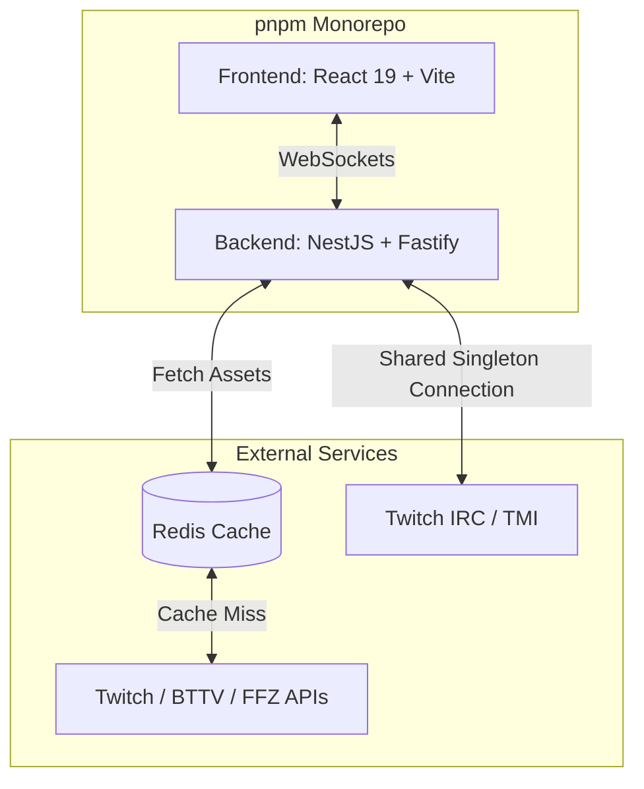

# 📺 Twitch Chat Visualizer

> **A high-performance, real-time Twitch chat overlay for modern streaming.**


---

## 📖 About The Project

**Twitch Chat Visualizer** is an enterprise-grade real-time chat overlay system designed for OBS, XSplit, and other broadcasting software. It listens to Twitch IRC channels and instantly renders chat messages, emotes, and user badges onto a highly customizable, transparent web overlay.

Originally built as a monolithic application, the project has been fully modernized into a scalable, type-safe monorepo. It resolves common pain points for streamers by ensuring ultra-low latency, eliminating memory leaks through intelligent connection pooling, and strictly sanitizing all inputs to prevent XSS vulnerabilities.

### ✨ Key Features
- **Real-Time Rendering:** Instantaneous chat delivery powered by WebSockets (Socket.IO).
- **Customizable Overlay:** Adjust fonts, background colors, and text colors dynamically via URL parameters.
- **Resource Optimization:** Centralized Twitch connection manager ensuring only one TMI client is spawned per channel, regardless of concurrent overlay viewers.
- **Robust Security:** Strict HTML sanitization to prevent XSS attacks from malicious chat messages.
- **Emote & Badge Support:** Native integration with Twitch, BTTV, and FFZ assets.

### 🏗️ Architecture Flow



---

## 🛠️ Tech Stack

This project leverages a modern, decoupled monorepo architecture using **pnpm workspaces**:

**Frontend (`apps/web`)**
- ⚛️ **React 19** & **Vite** - Lightning-fast UI rendering and build tooling.
- 🐻 **Zustand** - Minimalist, flux-like state management.
- 🎨 **Tailwind CSS v4** - Utility-first styling engine.

**Backend (`apps/api`)**
- 🦁 **NestJS 11** (Fastify Adapter) - Progressive Node.js framework.
- 🔌 **Socket.IO** & **tmi.js** - Real-time bidirectional event-based communication and Twitch IRC integration.
- 💾 **Redis** - In-memory data structure store for caching API assets and socket adapters.

**DevOps & Tooling**
- 🐳 **Docker & Docker Compose** - Containerized local development and production deployments.
- 🏗️ **Pulumi** - Infrastructure as Code (IaC) for AWS deployments.
- 🧪 **Vitest** - Blazing fast unit test framework.

---

## 🚀 Getting Started

### Prerequisites

Ensure you have the following installed on your local machine:
- [Node.js](https://nodejs.org/) (v22 or higher)
- [pnpm](https://pnpm.io/) (v9+)
- [Docker & Docker Compose](https://www.docker.com/)
- A Twitch Developer App (for `TWITCH_CLIENT_ID` and `TWITCH_CLIENT_SECRET`)

### Installation

1. **Clone the repository:**
   ```bash
   git clone https://github.com/your-username/twitch-chat-visualizer.git
   cd twitch-chat-visualizer
   ```

2. **Install dependencies:**
   ```bash
   pnpm install
   ```

3. **Configure Environment Variables:**
   ```bash
   cp .env.example .env
   ```
   *Edit `.env` and insert your Twitch Client ID and Secret.*

4. **Start the Infrastructure (Redis):**
   ```bash
   pnpm services:up
   ```

---

## 💻 Usage

### Development Mode
To start both the frontend and backend simultaneously in watch mode:
```bash
pnpm dev
```
- Frontend will be available at: `http://localhost:5173`
- Backend API/Sockets will be available at: `http://localhost:3000`

### Production Build
To compile the TypeScript code and build the React frontend:
```bash
pnpm build
```

To run the entire stack using Docker in production mode:
```bash
docker compose up -d
```

### OBS Integration Example
Once the server is running, add a **Browser Source** in OBS Studio with the following URL structure:
```text
http://localhost:5173/overlay/your_twitch_channel?namebackground=333333&namecolor=ffffff&messagebackground=ffffff&messagecolor=000000&fontsize=16
```
*(Customize the query parameters to match your stream's branding)*

---

## 📂 Project Structure

```text
twitch-chat-visualizer/
├── apps/
│   ├── api/                # NestJS Backend (WebSockets, Twitch TMI, Caching)
│   ├── web/                # React 19 Frontend (Overlay UI, Zustand)
│   └── infra/              # Pulumi IaC configuration for AWS
├── packages/
│   ├── shared/             # Shared TypeScript interfaces & types
│   └── config-ts/          # Centralized TS & ESLint configurations
├── docs/                   # Additional documentation (API, Onboarding)
├── .env.example            # Environment variables template
├── docker-compose.yaml     # Local orchestration (Redis, API, Web)
├── pnpm-workspace.yaml     # Monorepo workspace configuration
└── package.json            # Root configuration and scripts
```

---

## 🗺️ Roadmap / To-Do

Based on current architectural goals, the following improvements are planned:

- [ ] **Asset Caching:** Implement aggressive Redis caching for Twitch, BTTV, and FFZ emotes to prevent external API rate limiting.
- [ ] **E2E Testing:** Introduce **Playwright** to establish robust end-to-end testing for the critical path of the OBS overlay rendering.
- [ ] **Client-Side Routing:** Migrate to **TanStack Router** on the frontend for fully type-safe, deterministic routing.
- [ ] **Database Persistence:** Integrate PostgreSQL via **Drizzle ORM** to persistently store and load user-specific overlay configurations.
