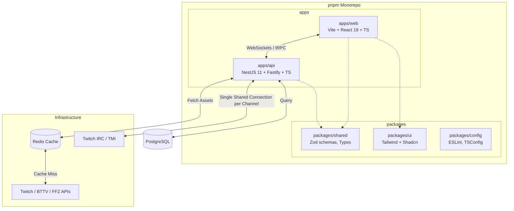

# Twitch Chat Visualizer - Modernization Roadmap (2026)

## 1. Executive Summary
This document outlines the strategic refactoring roadmap for the **Twitch Chat Visualizer** project. The objective is to transform the existing monolithic legacy application (CommonJS, Vanilla JS, Mustache templates, stateful Express/Socket.io) into a highly scalable, production-grade 2026-standard monorepo. The target architecture will leverage a **pnpm workspaces** monorepo containing a **NestJS (Fastify)** backend and a **Vite + React 19 + TypeScript** frontend. This modernization will resolve critical security flaws (XSS), severe memory leaks, and performance bottlenecks, ultimately providing a maintainable, type-safe, and highly observable platform ready for enterprise-level scaling.

---

## 2. Current State Assessment
**Current Stack:** Express.js, Socket.IO, Mustache, Vanilla JS/CSS, `tmi.js`, Yarn, Docker (Node 18).
**Architecture:** Monolithic MVC-like structure where the Express server handles API requests, static file serving, view templating, and WebSocket connections simultaneously.
**Codebase Health Score:** **3/10**

**Key Deficiencies Summary:**
- **Zero Type Safety:** Pure JavaScript implementation leaves the codebase prone to runtime errors.
- **Stateful Backend:** Reliance on local memory arrays (`connectedChannels`) and global variables (`global.access_token`) completely prevents horizontal scaling.
- **Security:** Severe Cross-Site Scripting (XSS) vulnerabilities on the frontend.
- **Resource Management:** Unbounded connection leaks and missing caching layers.

---

## 3. Critical Issues Inventory

| File/Module | Severity | Issue Category | Description | Recommendation (2026 Standard) |
| :--- | :---: | :--- | :--- | :--- |
| `public/assets/js/script.js`, `transparent.js` | **Critical** | **Security Flaws** | **XSS Vulnerability:** Chat messages (`messageObject.message`) are injected directly into the DOM via `insertAdjacentHTML` without HTML escaping or sanitization. | Migrate to React 19 which inherently escapes strings, and use `DOMPurify` if rendering raw HTML (e.g., for emotes). |
| `src/app/controllers/ChatController.js`, `SocketController.js` | **Critical** | **Code Errors / Memory Leak** | **Dangling Connections:** `startChat` instantiates a new `tmi.Client` connection to Twitch *per user socket*. When the socket disconnects, the TMI client is never destroyed, causing massive memory and connection leaks. | Implement a centralized Twitch Connection Manager service (Singleton) in NestJS that shares a single `tmi.js` client across all sockets listening to the same channel. |
| `src/app/controllers/RequestsController.js` | **High** | **Performance** | **Missing Caching / N+1 Calls:** `requestChannelAssets` makes 6 synchronous external API calls (Twitch, BTTV, FFZ) *per user connection*. This will quickly trigger API rate limits and slow down overlay loading. | Introduce Redis caching for channel assets (badges, emotes) with a TTL (e.g., 1 hour). Use `@nestjs/cache-manager`. |
| `src/app/middlewares/ClientMiddleware.js` | **High** | **Scalability / Logic Bug** | **Global State Mutation:** Token logic mutates `global.access_token` on HTTP requests. If the token expires, persistent WebSockets relying on this token will fail because they bypass HTTP middleware. | Store the App Access Token in Redis with a background worker (cron) responsible for refreshing it before expiration. Remove `global` usage. |
| `package.json`, `.eslintrc` (missing) | **Medium** | **Code Quality / Tech Debt** | **Outdated Tech:** CommonJS, `moment.js` (deprecated), Mustache templates, no TypeScript, no linting, huge functions. | Migrate to TypeScript, replace `moment` with `date-fns` or native `Intl`, and enforce strict ESLint/Prettier rules in a shared config package. |
| Codebase-wide | **Medium** | **Testing Gaps** | **Zero Tests:** Complete lack of unit, integration, and E2E tests. | Implement `Jest`/`Vitest` for backend services and `Playwright` for frontend E2E testing. |
| `Dockerfile`, `docker-compose.yaml` | **Low** | **CI/CD & DevOps** | **Basic DevOps:** Missing CI/CD pipelines, using older Node 18, single-stage Dockerfile. | Implement GitHub Actions for CI/CD, use multi-stage Docker builds com Node 22 LTS, e provisionamento de infraestrutura as code usando **Pulumi** na AWS (Free Tier). |

---

## 4. Target Architecture Blueprint

The project will transition to a Domain-Driven Design (DDD) structured monorepo using `pnpm`.

### Stack Details (2026 Standards):
- **Backend:** NestJS 11 (Fastify Adapter), PostgreSQL (Neon/RDS Free Tier), Drizzle ORM, Zod, Redis (ElastiCache Free Tier), BullMQ (Background Jobs), Socket.io (or native WebSockets).
- **Frontend:** React 19, Vite, TanStack Router, TanStack Query, Zustand (State Management), React Hook Form + Zod, TailwindCSS v4, Radix UI Primitives / Shadcn UI.
- **Infrastructure (AWS via Pulumi):** AWS EC2 (t4g.micro / Free Tier) or AWS App Runner, AWS RDS (PostgreSQL Free Tier), AWS ElastiCache (Redis Free Tier).
- **Tooling:** pnpm workspaces, TypeScript 5.5+, Vitest, GitHub Actions, Docker (multi-stage).

---

## 5. Migration Strategy
We will use a **Strangler Fig Pattern** combined with **Branch by Abstraction**. 
Since the current app is relatively small, the frontend and backend can be decoupled incrementally:
1. Wrap the existing Express app behind a reverse proxy (e.g., Nginx or directly within the new NestJS app as a fallback).
2. Stand up the new React frontend and route new traffic there, pointing to the legacy backend initially.
3. Migrate API endpoints and WebSocket namespaces one by one to NestJS.
4. Once all traffic is routed to NestJS, decommission the Express/Mustache monolith.

---

## 6. Implementation Plan

### Phase 0: Immediate Critical Fixes (Week 1)
- **Security:** Sanitize inputs in `public/assets/js/script.js` and `transparent.js` using a lightweight sanitizer to patch the XSS vulnerability.
- **Stability:** Add `client.disconnect()` in `SocketController.js` inside the `disconnect` method to stop the immediate TMI client memory leak.
- **Linting:** Add a basic `.prettierrc` and `.eslintrc` to stabilize the current code format.

### Phase 1: Monorepo Foundation (Week 2)
- Initialize `pnpm` workspace.
- Move the existing legacy codebase into `apps/legacy-express`.
- Scaffold `apps/api` (NestJS) and `apps/web` (Vite + React).
- Scaffold `packages/shared` for common DTOs and interfaces.
- Setup GitHub Actions CI pipeline (lint, build).

### Phase 2: Backend Modernization & Caching (Week 3-4)
- **NestJS Implementation:** Create the `TwitchService`, `EmoteCacheService`, and `ChatGateway` (WebSockets).
- **Resource Optimization:** Implement Redis to cache Twitch, BTTV, and FFZ emotes.
- **Connection Pooling:** Implement a singleton connection manager in NestJS to ensure only *one* `tmi.js` client connects per Twitch channel, regardless of how many users are viewing that channel's overlay.
- **Token Management:** Implement a background Cron service to handle `App Access Token` rotation securely in Redis.

### Phase 3: Frontend Rebuild (Week 5)
- Recreate the overlay UI using React 19 and Tailwind CSS.
- Implement React contexts/hooks for Socket.io state management.
- Ensure 100% parity with the configuration menu (`/transparent` view settings).
- Setup TanStack Router for clean client-side routing.

### Phase 4: Observability & DevOps (Week 6)
- Integrate structured logging (Pino) in NestJS.
- Add Health Checks (`@nestjs/terminus`).
- Create multi-stage `Dockerfiles` for both `apps/api` and `apps/web`.
- Update `docker-compose.yaml` to include Redis and the new services.

### Phase 5: Deprecation (Week 7)
- Reroute all traffic completely to `apps/web` and `apps/api`.
- Delete `apps/legacy-express`.
- Finalize documentation (README, Architecture Decision Records).

---

## 7. Risk Assessment & Rollback Plan

| Risk | Impact | Mitigation / Rollback |
| :--- | :--- | :--- |
| **Twitch API Rate Limits during migration** | High | The legacy system has no caching. Implement Redis in NestJS first. Rollback: Fallback to legacy app via reverse proxy. |
| **Overlay downtime for existing OBS users** | Critical | Users have hardcoded overlay URLs in OBS. We must maintain exact URL parity (`/:channel/transparent?settings...`). Route matching will be strictly tested. |
| **Socket connection drops** | Medium | Implement robust reconnection logic in the new React frontend. Keep the legacy Express container running until WebSockets are proven stable in staging. |

---

## 8. Definition of Done (2026 Standard)
- **Zero vulnerabilities** reported by `pnpm audit` and static analysis (SonarQube/ESLint).
- **100% Type Coverage:** No `any` types; all API contracts shared via `packages/shared`.
- **Performance:** Sub-50ms API response times (thanks to Redis). Single TMI connection per channel.
- **Test Coverage:** >80% unit test coverage (Vitest) and critical paths covered by E2E tests (Playwright).
- **CI/CD:** Automated builds, tests, and Docker image publishing via GitHub Actions.
- **Stateless:** Application can be scaled horizontally to $N$ instances without dropping state or duplicating Twitch IRC connections (using Redis Pub/Sub for socket broadcasting).

---

## 9. Appendices
- **Recommended Tech Radar (2026):**
  - **Runtime:** Node.js 22 LTS
  - **Package Manager:** `pnpm` v9+
  - **Infrastructure as Code:** `Pulumi` (TypeScript) targeting AWS Free Tier
  - **Frontend UI:** `TailwindCSS v4`, `Radix UI`, `shadcn/ui`, `lucide-react`
  - **Frontend State & Data:** `TanStack Query`, `TanStack Router`, `Zustand` (Global State)
  - **Frontend Forms:** `React Hook Form` + `Zod` (Validation)
  - **Backend DB & ORM:** `PostgreSQL`, `Drizzle ORM`
  - **Backend Queues:** `BullMQ` (com Redis)
- **Reference Docs:**
  - [NestJS Fastify Adapter](https://docs.nestjs.com/techniques/performance)
  - [Twitch API Documentation](https://dev.twitch.tv/docs/api/)
